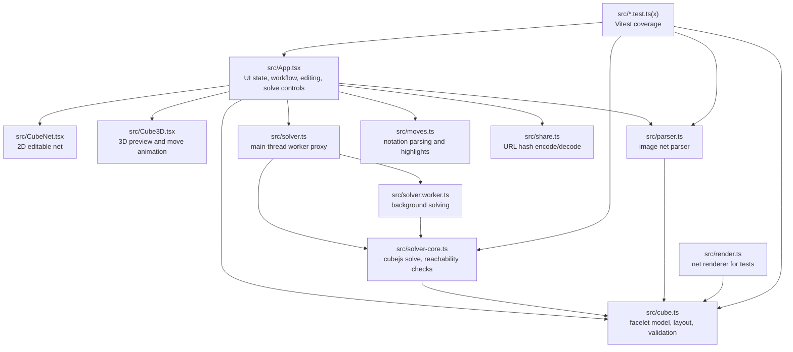

# RubikSolver Project Structure and Manual

## Project Structure

## Operation Manual

1. Use **Set Cube** as the starting page.
2. Click **Random Scramble** for a guaranteed legal 3x3 state.
3. Use **Import Image** only for a complete flat-net image with all 54 stickers.
4. Use **Paint** to correct stickers. Paint swaps another sticker back to keep color counts balanced, and blocks edits that would create an unreachable 3x3.
5. Use **Picker** to sample a sticker color, then return to Paint.
6. **Fill** is disabled because painting a whole face normally creates an impossible cube state.
7. Click **Solve** for a fast solution, or **Solve (Tightest)** to spend more time searching for a shorter 3x3 solution.
8. In the solution view, use **Prev**, **Next**, or **Play** to follow the moves. The net and 3D preview update with the current step.
